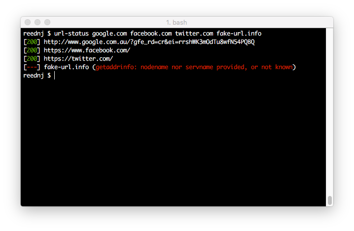

# url-status

`url-status` is a gem to check the http status of a list of urls. 

The urls can be provided as command line options, or they can come from a config file.

    # list of urls to check simply given as command line options
    # if no protocol is given, http is assumed
    url-status google.com https://facebook.com

    # pull the urls from the config file instead
    url-status --config ./site-list.yaml

The YAML file should be a simple array of the urls to check:

    ---
    - ssrs.reednj.com
    - paint.reednj.com
    - popacular.com/home
    - gigatweeter.com

If any of the urls fail, then the gem will return a status code of 1, allowing other action to be taken.

## Installation

    $ gem install url-status

## Contributing

Bug reports and pull requests are welcome on GitHub at https://github.com/[USERNAME]/url_status.

## License

The gem is available as open source under the terms of the [MIT License](http://opensource.org/licenses/MIT).

